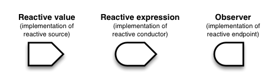
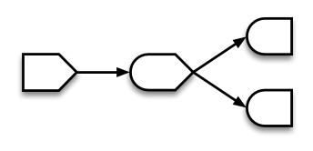

```{r, include = FALSE}
knitr::opts_chunk$set(
  collapse = TRUE,
  comment = "#>"
)
```

# Improvements to the plots

I added mean lines and made the x and y labels fancy by using the `expression` operator.

# Improvements to the dashboard

The floating options weren't aesthetically pleasing, so I moved all the options to the sidebar and made the plot bigger.

# Explain the widgets

I moved all the options widgets to the sidebar. For performing a boostrap sampling from a multivariate normal, the widgets feed into the server what inputs to feed into the helper functions. The helper functions then create output and sends those back to the server. The `sample size` slider bar determines the size of one bootstrap sample. The `iterations` widget determines how many bootstrap samples to obtain from the multivariate normal. The `mu 1` and `mu 2` widgets set the $\mu_1,\mu_2$ values in the multivariate normal function. The `variance x1` and `variance x2` functions determine $\sigma_{11}, \sigma_{22}$, respectively, in the $\Sigma$ covariance matrix. The `covariance x1,x2` determines $\sigma_{12}$ in the $\Sigma$ covariance matrix.

The plotting widget in the middle of the app plots the output of the bootstrap sampling from a multivariate normal.

# Reactivity

Shiny uses `reactive` environments to separate "static" objects from "dynamic" objects. There are three `reactive` objects: Values, Expressions, Observers.



Values are objects that signal other objects downstream that they need to re-execute. Usually, Values give arguments that are passed to the underlying functions. These arguments can either be predefined or user input. Expressions (or Conductors) are the underlying functions that perform our calculations and plotting, these are the functions that require most of the computation time. Expression outputs can be sent downstream or upstream. Observers are the objects that look upstream and process the outputs provided by Values and Expressions, and convert them to output in the user interface.

These objects allow for dynamic inputs to the app to produce the desired dynamic outputs. Only objects that live in the `reactive` environment/objects will function properly with user inputs.



Besides keeping dynamic and static variables separate, the `reactive` objects allow inputs/outputs to be passed to multiple objects.

# Demo

Below we have the lines of code required to run the app.

```{r setup, eval=FALSE}
library(shinyAppNiv)
launchApp()
```
